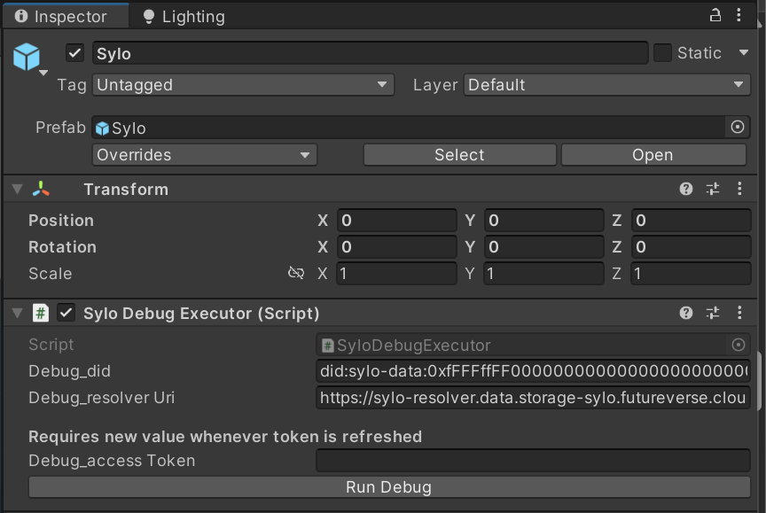
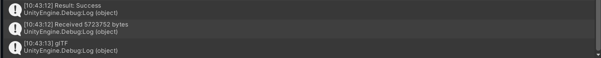

# sdk-unity-sylo

This Unity SDK supplies utilities for interacting with the Sylo data service. 

## API Reference

### SyloUtilities
The primary source of functions and data when interacting with the Sylo SDK
<details>
  <summary>Properties</summary>
  
  ```cs
  static string ResolverURI; // The resolver URI to use when making data requests
  ```

</details>
<details>
  <summary>Methods</summary>
  
  ```cs
  SetResolverURI(string uri); // Used to set the resolver URI property
  ```
  ```cs
  GetBytesFromDID (string did, ISyloAuthDetails authDetails, Action<byte[]> onSuccess, Action<Exception> onError); // Forms a web request using supplied resolver and DID, authenticates and sends request
  ```

</details>

### SyloDebugExecutor
An optional scene object to demonstrate runtime functionality and API usage.<br>
<details>
  <summary>Properties</summary>

  ```cs
  string debug_did; // The Sylo DID for the target data asset
  ```
  ```cs
  string debug_resolverUri; // The URI of the target Sylo Resolver
  ```
  ```cs
  string debug_accessToken; // The access token used to authenticate the request
  ```
</details>
<details>
  <summary>Methods</summary>

  ```cs
  RunDebug(); // Begin the process to retrieve bytes from the debug DID. Prints results to console.
  ```
</details>

### CoroutineSceneObject
A utility object used to run coroutines from the static `FuturePassAuthentication` class
<details>
  <summary>Properties</summary>

  ```cs
  CoroutineSceneObject Instance; // Singleton reference to the scene object
  ```
</details>

### ISyloAuthDetails
Interface definition for providing authentication details to the data provision process
<details>
  <summary>Properties</summary>

  ```cs
  string GetAccessToken(); // Override this to provide access token
  ```

</details>

## Getting Started: Using the Debug Function

<p>Locate and add the Sylo prefab to your game scene</p>
<p>This prefab has inputs for a data id, sylo resolver and access token.</p>


<br>
<p>For the purposes of debugging you may use the following:</p>

| Var | Data |
| --- | ---- |
| DID | did:sylo-data:0xfFFFffFF0000000000000000000000000000052f/ed38c341-a26a-4426-aed9-4f8f362b70bf |
| Resolver URI | https://sylo-resolver.data.storage-sylo.futureverse.cloud |

<br>
<p>This Sylo resolver is on the staging environment, and as thus needs to be authenticated with a staging FuturePass access token</p>

To get a valid access token, I recommend utilising the [FuturePass Unity SDK](https://github.com/futureversecom/sdk-unity-futurepass)

<p>Once a valid access token has been added to the DebugSyloExecutor component, press the "Run Debug" button.</p>


<p>After a moment, you should see a result packet written to the Console window. The speed of this will depend on your internet connection.</p>
